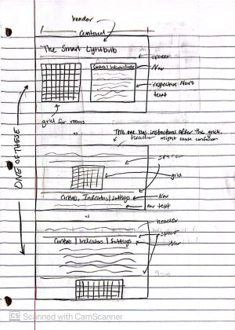
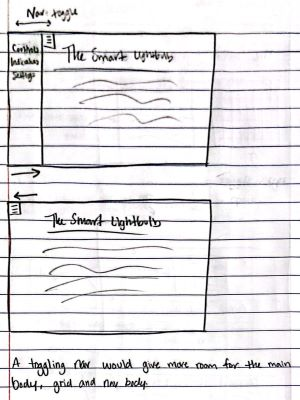

# User_Interface_Project_2

# TO-DO
- A title for the project, your names, and a link to your project write up. (In the GUI)
- A graphic to indicate where this UI would reside on the physical smart object. (In the GUI)
- An info button that, when clicked, explains the controls for simulating the object's use. (In the GUI) - William
- In the documentation
  -  Create a list of the controls you are including in this UI, the indicators you want display, and how these connect to the design goals you captured. (Label level 0)
  -  Demo video
- Levels 2-4 and beyond: 
  - fake voice commands - Nate
  - adding and editing lights - Nate
  - Scenarios - Nate
  - Day Play through - Nate
## Sam is working on (in order):
- adding lightbulb icon
- light fading and ray tracing for displaying light effects on the grid

# Helpful Commands
- npm run deploy - This will build and deploy the github page public website
- npm run dev - runs site locally

Group members: Nathan Suer, Sam Weese, William Braun, Owen Richards

# Project 2 check-in- collaboration plan

Group members: Nathan Suer, Sam Weese, William Braun, Owen Richards

- What will you do to make sure your team is successful. 
    - We will ensure that we have thoughful and efficient communication. We will make sure that everyone in the team is collaborating. We will foster a team of diverse thinkers in order to come up with the best solutions.
- How will you communicate? 
    - Discord Groupchat.
- How will you coordinate work? 
    - We will use a github repo and each person will have parts of the project they are in charge of.
- Do you plan to have regular meetings? 
    - Wednesday in-person after class or on discord if that doesn't work one week.
- Have you discussed team conflicts or obligations during the project time-frame? 
    - There are no conflicts we know of.
- How will you divide the work? 
    - For now, we will divide work based on skillsets due to not knowing the full extent of our project. As the project goes on, we will attempt to keep the workloads balanced while providing support to those who need it. 
    - Week 1 goals:
        - Sam 
            - Interviews
        - Owen
            - General UI layout
        - Nate 
            - Project setup and github repo
        - William 
            - User needs 
        

# Design

## Affordances
- A smart lightbulb would afford providing light when turned on 
- A smart lightbulb would afford remote control via a mobile app
- A smart lightbulb would afford changing color and brightness
- A smart lightbulb would afford integrating with other smart lightbulbs or devices 

## Physical Properties
- The lightbulb itself will be fixed due to being connected to the ceiling 
- It will be the size of a normal lightbulb, so it will not be too large
- The interface will be an app, so its size can vary based on the device it is being used on 

## Interviews
### Questions
1. If you had a lightbulb app, which tracked color changing lightbulbs, what features would you want?
2. How often would you use the lightbulbs?
3. If you have color changing lightbulbs, what do you currently use to control them?
4.  What features do you like of the current control system?
5. What statistics, if any, do you want tracked with your lightbulb?
6. What options do you want visible upon viewing an individual lightbulb?
7. Is there any way you would like lightbulbs grouped?   

### Interview 1:
1. If you had a lightbulb app, which tracked color changing lightbulbs, what features would you want?
- Grouping together lightbulbs, notes on lightbulbs, schedule on lightbulb, multiple color patterns on lighbulbs
2. How often would you use the lightbulbs?
- Every day. 
3. If you have color changing lightbulbs, what do you currently use to control them?
- Has color changing lightbulbs, doesn't change them unless necessary. Uses default Lumiman app.
4.  What features do you like of the current control system?
- Color wheel.
5. What statistics, if any, do you want tracked with your lightbulb?
- Days used, time since installation, hours estimated left
6. What options do you want visible upon viewing an individual lightbulb?
- Name, description, color, schedule
7. Is there any way you would like lightbulbs grouped?
- By room and by schedule
### Interview 2:
1. If you had a lightbulb app, which tracked color changing lightbulbs, what features would you want?
- Grouping together lightbulbs, multiple color patterns on lighbulbs, patterns on lightbulbs by room
2. How often would you use the lightbulbs?
- Every day, probably changing the themes by room by time of day
3. If you have color changing lightbulbs, what do you currently use to control them?
- No color changing lightbulbs.
4.  What features do you like of the current control system?
- N/A
5. What statistics, if any, do you want tracked with your lightbulb?
- Days used, colors used, rooms used
6. What options do you want visible upon viewing an individual lightbulb?
- Name, color, schedule, room
7. Is there any way you would like lightbulbs grouped?
- By schedule
### Interview 3:
1. If you had a lightbulb app, which tracked color changing lightbulbs, what features would you want?
- Grouping together lightbulbs by room, turning multiple lights on and off, 
2. How often would you use the lightbulbs?
- Every day
3. If you have color changing lightbulbs, what do you currently use to control them?
- No color changing lightbulbs.
4.  What features do you like of the current control system?
- N/A
5. What statistics, if any, do you want tracked with your lightbulb?
- Hours left on lightbulb, time used, how often used, when used
6. What options do you want visible upon viewing an individual lightbulb?
- Name, color, room
7. Is there any way you would like lightbulbs grouped?
- By room, by color, by use amount
### Interview 4:
1. If you had a lightbulb app, which tracked color changing lightbulbs, what features would you want?
- Grouping together lightbulbs by any means, lightbulbs with individual names, controlling groups, changing colors
2. How often would you use the lightbulbs?
- Only on special occasions, like a party
3. If you have color changing lightbulbs, what do you currently use to control them?
- No color changing lightbulbs.
4.  What features do you like of the current control system?
- N/A
5. What statistics, if any, do you want tracked with your lightbulb?
- User did not think of any
6. What options do you want visible upon viewing an individual lightbulb?
- Name, color, group
7. Is there any way you would like lightbulbs grouped?
- Not really

## Assumptions
- The smart lightbulb will track its temperature
- The smart lightbulb will keep track of its current color setting and have functionality for said color to be changed 
- The smart lightbulb will have its location within the house stored, allowing the user to adjust lightbulbs remotely
- The smart lightbulb will have multiple settings, including being on between certain hours and maintaining a certain color or pattern
- The smart lightbulb will track its energy usage

## User Needs
- User needs to be able to group lightbulbs based on schedules, rooms, colors, and more
- User needs to be able to turn multiple lights on and off at once
- User needs to be able to track several statistics for the lightbulb, including days used, time since installation, lifespan of the lightbulb, rooms used, colors used, how often used, and when used
- User needs to be able to name lightbulbs and add descriptions or notes
- User needs to be able to choose from a selection of colors 
- User needs to be able to set themes and schedules
- User needs to be able to control lightbulbs by groups

## Design Requirements
- Functionality for organizing lightbulbs within the interface based on a variety of properties, such as room, color, schedule, and more
- Provide the ability to turn multiple lightbulbs on or off simultaneously 
- Track statistics about each lightbulb, including days used, time since installation, colors used, and more
- Make the name of each lightbulb customizable in the interface, and add a section for notes / descriptions as well 
- Add customizable colors - could use a color wheel or allow the user to input color codes
- Functionality for creating schedules and themes that can affect multiple lights at once 
- Group lightbulbs by predefined criteria and make these groups controllable 

## Sketching 

### Sketching design alternatives to 3 design challenges (10-plus-10)
 
Header and navigation positioning.

 
Main body positioning. We think it would be best to have the controls and grid displayed at the same time for the user's convenience. 

 
Navigation and/or controls are toggleable to leave room for the main grid.

### Sketching the interface ("the vanilla sketch") 

### Storyboard sketch

1. User reads the header to understand basic concept of the page.
2. User will probably see the grid next.
3. The user will probably be confused by the grid and will then read the controls, located in the box next to it.
4. User can now interact with our device's simulation.

### Hybrid sketching to illustrate the integration of the interface on a real object
- So we're designing a smart lightbulb, a user wants to control the lightbulb via an app.
- But sice it needs to be physical and digitize something that is usually physical, it would be good to replace the light switches with our interface.
- For our hybird sketch I will be integrating our smart lightbulb interface to replace a light switch.
- This is my puppy Millie.

## User Feedback
- The user feedback we primarily received was that our choice of displaying the grid and controls at the same time was a good idea, as the grid was confusing at first. There was also a 2-1 split between whether or not the grid should be interacted with to turn lights on and off, instead of just displaying the current house's condition. Finally, they all agreed with only needing "Controls" and "Description" menus on the right.

# AI Use
- I used the following prompt "Using svelte and js, make me a component that will allow me to design floorplans for houses. All floorplans are one floor. Have options for doors, lights, and walls" to get the basic room maker. It was functional. This was useful but only will be used as a basis for future work. Here is an image of what was made

- Used chatgpt to make svg icon for power button and mic button
- 
